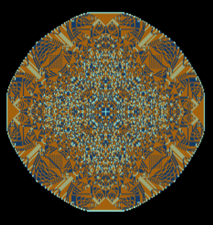

# Sandpiles

Interactive cellular automata model. Learn more about the Abelian sandpile model [here](https://en.wikipedia.org/wiki/Abelian_sandpile_model). Like many cellular automata systems, the rules for this one are simple: every cell can hold up to 3 "sand grains"; if it has more, they fall down onto the adjacent cells - left, right, top, and bottom.

[Live website](https://amaralis.github.io/sandpiles/)

 |  | 
--- | --- | ---
 |  | 

# How to use

1. Use the top left input box to choose how many sand grains you want to drop onto the grid
2. Use the controls to the left, right, and top of the canvas to choose where your sand is going to be dropped (red circles will mark the spots, unless you choose to drop the sand with your mouse cursor)
3. Click the "Add X grains to your selected spots" button at the top of the page
4. Click the "Start Simulation" button at the top of the page
5. Enjoy the fractal patterns and collisions between piles

# How it works

By dumping a large amount of "sand" onto a cell, and coloring the cells acording to the number of sand grains they hold, we can see how this system's rules create beautiful, fractal-like patterns.
Once the algorithm has run its course and the cells are all stable, not toppling over their contents onto their neighbors, that state is called the "identity element" for that particular system. In other words, its "zero".

# What I set out to achieve with this project

- [X] Understanding how the browser displays images on a canvas
- [X] Understanding how raw pixel instructions work
- [X] Understanding how to navigate cartesian and polar coordinate systems interchangeably
- [X] Creating a tool to visualize emergent patterns and behaviors from simple rules

# What I learned with this project

* Animating cellular automata may require an intermediate step between states, where cell interactions are recorded in one data structure and cells that had no interactions remain in some "previous" data structure. Only after all interactions have been recorded does the "previous" state become the "current" state. This prevents a cascade effect that will ruin the animation and may affect the algorithm itself
* For my own amusement, I also learned how to use html5 audio. This was solely for the purpose of making a presentational video on the project and has no impact on the application's core functionality
* Simple trigonometry can be immensely useful, and indeed necessary, in a variety of scenarios
* No application is too small for clean, scalable code. Clean and scalable also means easier to debug and modify. As it stands, modifying the application, even something as simple as this, would likely be as much, if not more, time consuming than rebuilding it from scratch
